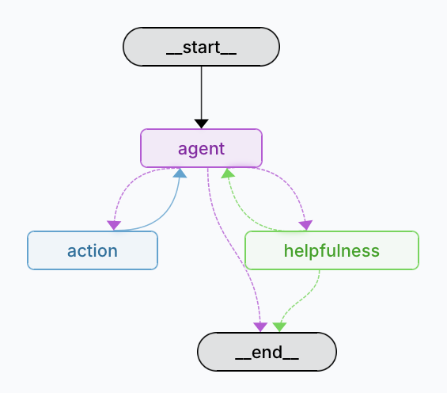

## <h1 align="center" id="heading">Session 14: Build & Serve Agentic Graphs with LangGraph</h1>

| 🤓 Pre-work | 📰 Session Sheet | ⏺️ Recording     | 🖼️ Slides        | 👨‍💻 Repo         | 📝 Homework      | 📁 Feedback       |
|:-----------------|:-----------------|:-----------------|:-----------------|:-----------------|:-----------------|:-----------------|
| [Session 14: Pre-Work](https://www.notion.so/Session-14-Deploying-Agents-to-Production-21dcd547af3d80aba092fcb6c649c150?source=copy_link#247cd547af3d80709683ff380f4cba62)| [Session 14: Deploying Agents to Production](https://www.notion.so/Session-14-Deploying-Agents-to-Production-21dcd547af3d80aba092fcb6c649c150) | [Recording!](https://us02web.zoom.us/rec/share/1YepNUK3kqQnYLY8InMfHv84JeiOMyjMRWOZQ9jfjY86dDPvHMhyoz5Zo04w_tn-.91KwoSPyP6K6u0DC)  (@@5J6DVQ)| [Session 14 Slides](https://www.canva.com/design/DAGvVPg7-mw/IRwoSgDXPEqU-PKeIw8zLg/edit?utm_content=DAGvVPg7-mw&utm_campaign=designshare&utm_medium=link2&utm_source=sharebutton) | You are here! | [Session 14 Assignment: Production Agents](https://forms.gle/nZ7ugE4W9VsC1zXE8) | [AIE7 Feedback 8/7](https://forms.gle/juo8SF5y5XiojFyC9)

# Build 🏗️

Run the repository and complete the following:

- 🤝 Breakout Room Part #1 — Building and serving your LangGraph Agent Graph
  - Task 1: Getting Dependencies & Environment
    - Configure `.env` (OpenAI, Tavily, optional LangSmith)
  - Task 2: Serve the Graph Locally
    - `uv run langgraph dev` (API on http://localhost:2024)
  - Task 3: Call the API
    - `uv run test_served_graph.py` (sync SDK example)
  - Task 4: Explore assistants (from `langgraph.json`)
    - `agent` → `simple_agent` (tool-using agent)
    - `agent_helpful` → `agent_with_helpfulness` (separate helpfulness node)

- 🤝 Breakout Room Part #2 — Using LangGraph Studio to visualize the graph
  - Task 1: Open Studio while the server is running
    - https://smith.langchain.com/studio?baseUrl=http://localhost:2024
  - Task 2: Visualize & Stream
    - Start a run and observe node-by-node updates
  - Task 3: Compare Flows
    - Contrast `agent` vs `agent_helpful` (tool calls vs helpfulness decision)

🚧 Advanced Build 🚧 (OPTIONAL - <i>open this section for the requirements</i>)

- Create and deploy a locally hosted MCP server with FastMCP.
- Extend your tools in `tools.py` to allow your LangGraph to consume the MCP Server.

# Ship 🚢

- Running local server (`langgraph dev`)
- Short demo showing both assistants responding

# Share 🚀
- Walk through your graph in Studio
- Share 3 lessons learned and 3 lessons not learned

---

#### ❓ Question:

What is the purpose of the `chunk_overlap` parameter when using `RecursiveCharacterTextSplitter` to prepare documents for RAG, and what trade-offs arise as you increase or decrease its value?

##### ✅ Answer:

The `chunk_overlap` parameter in `RecursiveCharacterTextSplitter` controls how many characters from the end of one chunk are duplicated at the beginning of the next chunk. This creates overlapping regions between adjacent text segments.

The main purpose is to preserve context continuity across chunk boundaries. When text is split into discrete chunks, important information that spans the boundary between chunks can be lost or fragmented. Overlap ensures that concepts, sentences, or ideas that cross boundaries remain intact in at least one chunk.

- Increasing overlap
  - Pros:
    - Better context preservation - More likely to capture complete thoughts, sentences, or concepts that span boundaries
    - Improved quality - Queries about topics near chunk boundaries have better chance of matching relevant content
    - Enhanced coherence - Retrieved chunks contain more complete context for the LLM to work with
  - Cons:
    - Increased storage requirements - More total tokens stored due to duplication
    - Higher computational cost - More chunks to process during embedding and retrieval
    - Potential noise - Retrieved chunks may contain redundant information
    - Slower indexing - More content to embed and store

- Decreasing overlap
  - Pros:
    - Better storage efficiency - Less duplication means smaller vector database
    - Faster processing - Fewer total chunks to embed and search through
    - Cleaner retrieval - Less redundant information in results
    - Lower costs - Fewer tokens to process in embedding models
  - Cons:
    - Context fragmentation - Important information more likely to be split across boundaries
    - Degraded retrieval - Queries about boundary-spanning topics may miss relevant content
    - Incomplete context - Retrieved chunks may lack sufficient context for accurate responses

#### ❓ Question:

Your retriever is configured with `search_kwargs={"k": 5}`. How would adjusting `k` likely affect RAGAS metrics such as Context Precision and Context Recall in practice, and why?

##### ✅ Answer:

There's typically an optimal k value where recall gains balance precision losses. This varies by:
- Domain complexity: Technical domains may need higher k
- Query specificity: Broad queries benefit from higher k, specific queries from lower k
- Chunk granularity: Smaller chunks may require higher k to capture complete context

Increasing k typically *improves Context Recall*, however, there are diminishing returns because beyond a certain point (often k=10-15), additional chunks rarely contain new relevant information and this may plateau or even slightly decrease if irrelevant chunks start overwhelming the relevant ones.

Increasing k often *decreases Context Precision* because as you retrieve more chunks, the proportion of truly relevant ones typically decreases. In addition, lower-ranked chunks are more likely to be tangentially related or irrelevant and retrieval systems are generally more accurate in their top rankings than deeper ones.

System-level effects:

- LLM performance: Too many chunks can overwhelm the LLM's context window or attention mechanisms
- Response quality: More chunks mean more potential for the LLM to get confused or focus on irrelevant details
- Latency: Higher k increases processing time

The advice to optimize k is to start at about `k=5` and evaluate results of Context Recall and Context Precision to find the best value for the use case in practice.

#### ❓ Question:

Compare the `agent` and `agent_helpful` assistants defined in `langgraph.json`. Where does the helpfulness evaluator fit in the graph, and under what condition should execution route back to the agent vs. terminate?

##### ✅ Answer:

Where does the helpfulness evaluator fit in the graph?
- The helpfulness node is on a conditional edge connected to the main agent

Under what condition should execution route back to the agent vs. terminate?

Routes back to agent when:
  - The helpfulness evaluator returns "N" (not helpful enough)
  - The conversation has fewer than 10 messages
  - Specifically: line 87 returns "continue" which routes back to "agent"

Terminates when:
  1. Helpfulness achieved: The evaluator returns "Y" (line 86-87)
  2. Message limit exceeded: More than 10 messages in conversation (line 46-47, returns "HELPFULNESS:END")
  3. Safety limit hit: When "HELPFULNESS:END" marker is detected (line 81-82)

 
